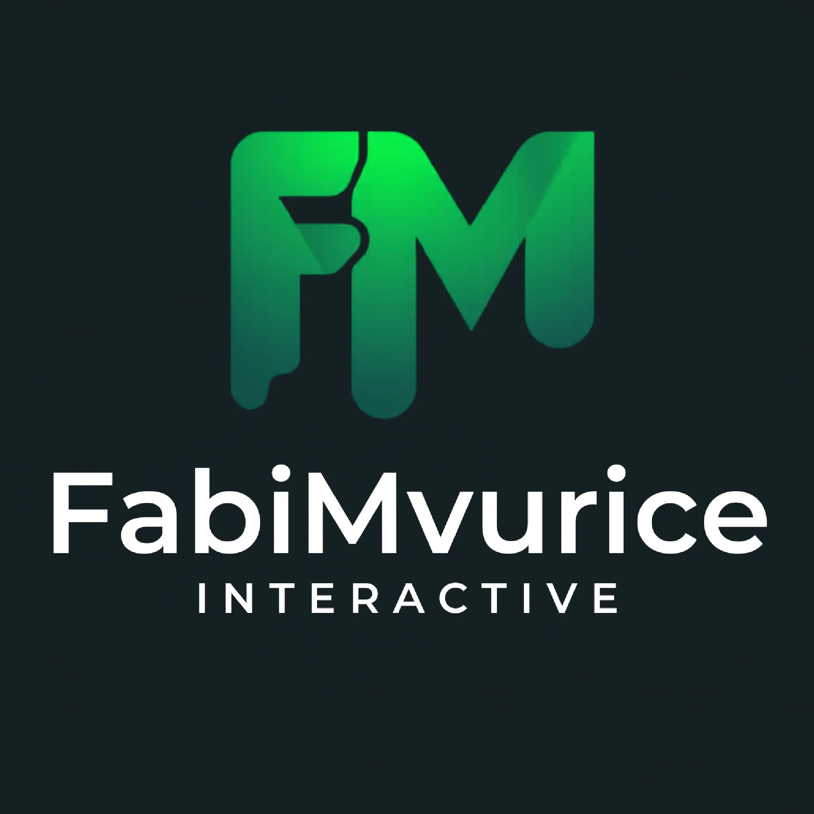

<p align="center">
  
</p>

<h1 align="center">FabiMvurice Interactive</h1>

<p align="center">
  Creating Minecraft modpacks, mods, and resource packs since 2023.
</p>

<p align="center">
  <a href="https://www.fabimvurice-interactive.de"></a>
  
  
  
</p>

<p align="center">
  <a href="https://discord.gg/x9jsed8qyR">Discord</a> &middot;
  <a href="https://x.com/famvinteractive">X / Twitter</a> &middot;
  <a href="https://www.youtube.com/@fm-studios-mc">YouTube</a> &middot;
  <a href="https://www.instagram.com/fabimvurice.interactive">Instagram</a> &middot;
  <a href="https://www.tiktok.com/@fabimvurice.interactive">TikTok</a>
</p>

---

## About

This is the source code for the **FabiMvurice Interactive** website a central hub for our Minecraft projects, news, changelogs, roadmap, guides, and downloads.

The site uses a glassmorphism design system called **"Nebula"**: translucent glass cards with backdrop blur over deep blue-black backgrounds, neon accent glows, noise texture, animated grid lines, and ember particle effects. Red-magenta-purple accents throughout.

## Projects

| Project | Type | Status | Downloads |
|---------|------|--------|-----------|
| **Create Unbound** | Modpack (Tech) | Coming Soon | — |
| **Fabi's Lootr** | Resource Pack | Active | 21K+ |
| **{Additions}** | Modpack (Vanilla+) | Discontinued | 10K+ |
| **Create F&M 3** | Modpack (Tech) | Discontinued | 19K+ |
| **Create F&M 2** | Modpack (Tech) | Discontinued | 2.7K+ |
| **Create F&M** | Modpack (Tech) | Discontinued | 275 |

Available on [CurseForge](https://www.curseforge.com/members/fabimvurice_interactive/projects) and [Modrinth](https://modrinth.com/user/FabiMvurice_Interactive).

## Tech Stack

| | |
|---|---|
| **Framework** | [Astro](https://astro.build/) 5.18 (static output) |
| **Styling** | [Tailwind CSS](https://tailwindcss.com/) 4.2 via `@tailwindcss/vite` |
| **Language** | TypeScript |
| **SEO** | `@astrojs/sitemap` for auto-generated sitemaps |
| **Fonts** | Inter (body) + Space Grotesk (display) |
| **Hosting** | GitHub Pages |

Zero runtime dependencies. No React, Vue, or Svelte... pure Astro components with vanilla JS.

## Getting Started

**Prerequisites:** Node.js 18+, Git

```bash
# Clone
git clone https://github.com/FmStudios-MC/FmStudios-Site.git
cd FmStudios-Site

# Install
npm install

# Develop
npm run dev

# Build
npm run build

# Preview production build
npm run preview
```

## Pages

| Route | Description |
|-------|-------------|
| `/` | Homepage with hero, featured projects, latest news, and community CTA |
| `/projects` | Project showcase with search and category filters |
| `/projects/[slug]` | Individual project detail pages with screenshots and downloads |
| `/news` | News listing with search and category filters |
| `/news/[slug]` | News articles with reading time, share buttons, and prev/next nav |
| `/roadmap` | Kanban-style development roadmap with progress tracking |
| `/changelog` | Version history per project with project filter |
| `/wiki` | Guides, tutorials, and FAQ knowledge base with search |
| `/gallery` | Screenshot gallery with lightbox viewer and project filter |
| `/downloads` | Centralized download hub for all projects |
| `/about` | Studio info, team, milestones, and tech stack |
| `/community` | Discord CTA, social links, and community guidelines |
| `/server-status` | Game server status with address copy-to-clipboard |
| `/hosting` | Kinetic Hosting partnership page |
| `/404` | Custom "Page Not Found" with Nebula styling |

## Project Structure

```
src/
├── components/     Astro components (NavBar, Footer, Icon, modals, cards)
├── data/           TypeScript data files (projects, news, roadmap, etc.)
├── layouts/        Layout with top nav, SEO meta, grid lines, noise overlay, embers
├── pages/          15 pages (see table above)
├── scripts/        Client-side TS (animations, lightbox, modals, search, theme)
└── styles/         Design tokens and component styles (global.css)
```


## License

Proprietary — all rights reserved by FabiMvurice Interactive. See [LICENSE](LICENSE) for details.
